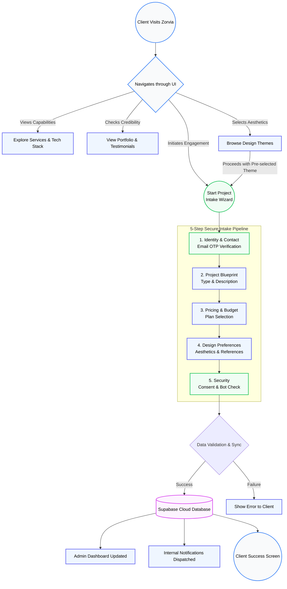

# Zorvia Digital Platform Overview

## 🎯 Platform Purpose
Zorvia Digital operates as a **premium digital agency platform** that seamlessly bridges the gap between client vision and high-end software execution. Built with modern web technologies (React, Vite, Supabase), it is designed to provide an immersive, futuristic user experience while acting as a robust portal for generating leads, securely collecting project requirements, and showcasing a diverse portfolio.

## ✨ Key Benefits
- **Streamlined Client Onboarding:** A robust 5-step interactive intake wizard (Identity, Blueprint, Pricing, Design, Verify).
- **Enterprise-Grade Security:** Incorporates real-time OTP verification (via Email/Twilio) and bot protection before any project data is submitted.
- **Premium User Experience:** Employs futuristic glassmorphism aesthetics, Framer Motion animations, and 3D backgrounds (Three.js) to leave a lasting, high-end impression.
- **Real-Time Data Sync:** Uses Supabase for instant processing of user inquiries, administrative updates, and dashboard synchronization.
- **Scalable Architecture:** Designed with maintainable code structures, AI integrations (Mistral AI), and modular React components.

---

## 🔄 Platform Workflow Flowchart

Below is a detailed flowchart of the platform's step-by-step workflow, illustrating the journey from when a client visits the website to the secure backend project ingestion.

---
> **Note:** The steps illustrated above are powered by React Router for smooth single-page transitions, utilizing a "Chrome-less" app wrapper for focus-intensive areas like the project intake and admin panels.
